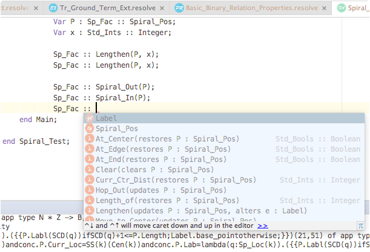

# IntelliJ Idea Plugin for RESOLVE (lite)

A [Jetbrains](https://www.jetbrains.com/idea/) plugin for the
RESOLVE specification and programming language. Compatible with IntelliJ v13.x-15.x.

## At a glance

The initial release(s) of this plugin provides the following features

- syntax highlighting
- syntax error checking
- keyword completion
- *limited* reference completion
- syntax color settings page
- compiler codegen support

You can right click resolve files and generate code for them, or simply press `cmd` + `shift` + `G`, automatically generating code to the `\gen` directory. 

For symbols with semantic information available, `cmd` + `mouse1` will take you ot that symbol's declaration if there is one available. Syntax errors within source code are underlined with red squigglies and their relative locations are marked in the rhs gutter.

While typing, you can select from a popup list any available keywords or constructs. Pressing the tab key will automatically complete and inject the suggested keyword, reference, or construct. If it's a bigger construct (one requiring input for a number of fields), pressing tab repeatedly visits all required fields, allowing users to fill-in each incrementally.

## History

See our [github releases](https://github.com/Welchd1/resolve-intellij-plugin/releases) page.

## Screenshots

### Syntax highlighting and error reporting

### Keyword completion

### Live templates

Live templates are predefined 'documents with holes' that users
can fill in dynamically. These are a good match for RESOLVE's more syntactically
verbose constructs. Invocation of a live template enabled construct is handled
the same way as keyword completion: you just start typing and select the
construct you want from the list.

We currently support live templates for the following constructs:
- all modules
- facility declarations
- type models
- type representations
- operations
- operation-procedures
- procedures

### Reference completion

### Goto declaration

### File type legend

Think of orange circular icons as non-executable *specification* based modules
(e.g. concepts, extension) and greenish/teal icons as *implementations* --
with blue reserved exclusively for RESOLVE's mathematical developments.

The IDE will automatically update a file's icon based on the module declared
within.

### RESOLVE tool output
You can generate code for a `.resolve` file by right clicking on the file and pressing play:

By default, generated code will get written to `\gen` at which point, then can be executed by simply creating a java run configuration. After this, execution results will display as usual in the IDE's terminal:

### Color preferences

## Desirable future developments

- semantic inspections and checking
- refactor rename
- goto declaration
- find usages
- better ref completion capabilities
- unicode support for math (?)
- structure view

