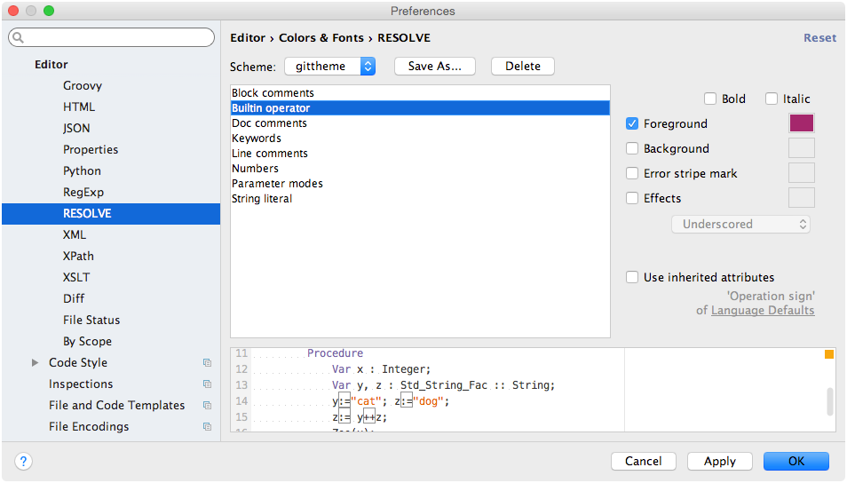

# IntelliJ Idea Plugin for RESOLVE (lite)

An [IntelliJ](https://www.jetbrains.com/idea/) 13.x, 14.x plugin for the
RESOLVE specification and programming language.

This plugin is compatible with  all versions of the [RESOLVE tool]
(https://github.com/Welchd1/resolve-lite) from 0.0.1.

## At a glance

The initial release(s) of this plugin provides the following features
- syntax highlighting
- syntax error checking
- code folding (comments, functions, etc)
- spellchecking
- keyword completion
- *limited* reference completion (type refs only atm)
- syntax color settings page
- dedicated RESOLVE language Sdk type
- 'right click to run' executable facilities/modules
- live template support

You can create run configurations for executable modules, or simply right click
on a file and press play to run the compiler, automatically executing any
generated code. Built run configurations however give users more options such as
the ability to pass custom options to the compiler, specify tool output dirs,
etc; these built configurations are preserved across IDE runs.

For symbols with semantic information available (these and other occurences
are highlighted when clicked), cmd + mouse1 will take you to that symbol's
declaration if there is one available.

Syntax errors within source code are underlined with red squigglies and their
relative locations are marked accordingly in the rhs gutter.

While typing you can select from a popup context list any available
keywords or constructs. Pressing the tab key will automatically complete and
inject the construct. If it's a bigger construct (one requiring input for
multiple fields), pressing tab repeatedly visits all required fields allowing
users to fill-in each one incrementally.

## History

See our [github releases]() page.

## Screenshots

### Syntax highlighting and error reporting

### Keyword completion

### Live templates

Live templates are predefined 'documents with holes' that users
can fill in dynamically. These are a good match for RESOLVE's more syntactically
verbose constructs. Invocation of a live template enabled construct is handled
the same way as keyword completion: you just start typing and select the
construct you want from the list.

We currently support live templates for the following constructs:
- all modules
- facility declarations
- type models
- type representations
- operations
- operation-procedures
- procedures

### Reference completion

### Goto declaration

### Custom Sdk type

All RESOLVE files should be rolled into our custom Sdk package type:

For example, you can create a simple 'hello world' starter project by clicking
the sdk project type, and naming it `HelloWorld` when prompted. Once created,
you can select 'Facility Module' from the menu:

.. giving it a reasonable name:

And assuming the RESOLVE tool is indeed communicating with the project, you
should be able to peruse and view (but not edit!) RESOLVE's standard libraries
and supporting Java (runtime) code through the project pane:

#### Custom file icons

Each resolve file houses one of five distinct modules types. Thus, to help
distinguish the contents of one file from another at the tree-view level, we
use colored, circular icons labeled by the first two letters of the module type
housed within:

Think of orange circular icons as non-executable *specification* based modules
(e.g. concepts, enhancements) and greenish/teal icons as *implementations* --
with blue reserved exclusively for RESOLVE's mathematical developments.

The IDE will automatically update a file's icon based on the module declared
within.

### RESOLVE tool output
You can run executable files by right clicking on the file and pressing play:

.. you can review tool output + execution results in the IDE's terminal:

### Custom run configurations

The previously shown route to execution implicitly creates a resolve run
configuration. However, if you want more control over a run (i.e. providing
specific tool flags or changing tool output dirs) you can always manually
create the configuration:

### Color preferences

## Desirable future developments

- semantic inspections and checking
- refactor rename
- goto declaration
- find usages
- increased ref completion capabilities
- unicode support for math (?)
- structure view

## Contribute

We encourage anyone and everyone to contribute to enhancing and further
developing this plugin. Please consult the plugin [wiki]
(https://github.com/Welchd1/resolve-intellij-plugin/wiki) for developer notes,
and other articles discussing the specifics of this plugin's
development/codebase.
